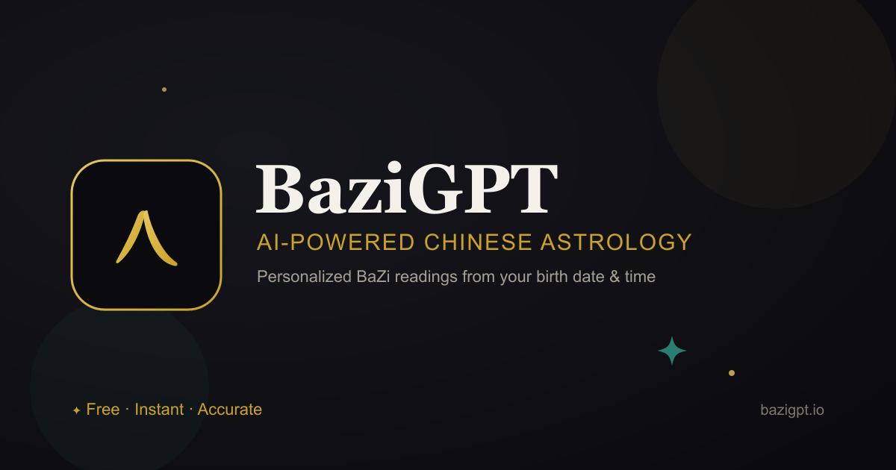

# BaziGPT — AI-Powered Chinese Astrology

[](https://www.bazigpt.io)
[](https://opensource.org/licenses/MIT)
[](https://react.dev/)
[](https://www.typescriptlang.org/)
[](https://tailwindcss.com/)

> Ancient Chinese astrology (BaZi / 八字 — the Four Pillars of Destiny) meets modern AI.
> Enter a birth date and time, get an instant, personalized reading. No signup. Free.

**Live:** **[www.bazigpt.io](https://www.bazigpt.io)**



---

## ✨ What it does

- **Solo reading** — a full BaZi Four Pillars analysis from your birth date & time, with an AI-generated breakdown of your core self, favorable/unfavorable elements, luck cycles, and life path.
- **Compatibility reading** — analyze the chemistry between two charts.
- **Daily forecast** — today's cosmic energy for everyone, plus an optional *personalized* daily forecast keyed to your own pillars.
- **Famous charts** — a searchable, categorized gallery of 100+ celebrities and historical figures, each with their own BaZi reading and shareable page (great SEO long-tail).
- **Interactive follow-ups** — ask targeted questions about love, career, health, and wealth.
- **Shareable cards** — beautiful, brand-styled reading cards (rasterized client-side and server-rendered as PNG) for social sharing.
- **Three languages** — English, ไทย (Thai), and 中文 (Chinese), with automatic browser-language detection.

## 🎨 Design — "Celestial Noir"

A bespoke, mobile-first design system built from scratch on design tokens:

- Obsidian (`#0b0b0f`) base, gold (`#c9a227`) and jade (`#2e8b7b`) accents, Cormorant Garamond display + Inter body.
- A living, animated celestial backdrop (drifting aurora, twinkling/shooting stars, breathing glow orbs) rendered with pure CSS/SVG.
- A full maximalist motion layer — scroll-triggered reveals (`IntersectionObserver`), entrance animations, shimmer/glow effects, and a "consulting the cosmos" cosmic loader — **all gated behind `prefers-reduced-motion`** for accessibility.

## 🛠️ Tech Stack

| Layer | Choice |
| --- | --- |
| Build | **Vite 6** + TypeScript 5 (project references, code-split routes) |
| UI | **React 18**, **Tailwind CSS v4**, **shadcn/ui** on **Radix** primitives, `lucide-react` |
| Routing | React Router 7 with lazy-loaded routes |
| i18n | i18next / react-i18next (en · th · zh) + browser language detection |
| Backend | **Vercel serverless functions** (`/api`) |
| Data | **Neon** serverless Postgres (famous-people dataset) |
| AI | OpenAI Chat Completions (`gpt-4o-mini`) |
| SEO/meta | `react-helmet-async`, JSON-LD structured data, **dynamic DB-backed sitemap** |
| PWA | Service worker + Web App Manifest |
| Analytics | Vercel Analytics + Speed Insights |

> **Performance note:** this app was migrated off Material-UI + Emotion onto Tailwind v4 + shadcn, deleting the ~289 KB MUI core chunk and the entire CSS-in-JS runtime — a large LCP/TBT win on mobile.

## 🚀 Getting Started

**Prerequisites:** Node.js 18+, npm.

```bash
# 1. Install
npm install

# 2. Environment — create .env in the project root
OPENAI_API_KEY=sk-...           # server-side, used by /api functions
NEON_DATABASE_URL=postgres://... # famous-people dataset

# 3. Develop (Vite dev server)
npm run dev

# 4. Run the full stack locally (serverless functions + frontend)
vercel dev

# 5. Production build
npm run build
```

### Scripts

| Command | Description |
| --- | --- |
| `npm run dev` | Vite dev server (frontend only) |
| `npm run build` | Type-check (`tsc -b`) + production build |
| `npm run preview` | Preview the production build |
| `npm run lint` | ESLint over the whole project |

## 🗂️ Project Structure

```
api/                 Vercel serverless functions (readings, daily, compatibility,
                     famous-people CRUD, share-card PNGs, dynamic sitemap)
src/
  components/        Feature components
    brand/           Celestial design system (background, hero, loader, reveals)
    reading/         Shared reading primitives (inputs, share dialog, markdown)
    ui/              shadcn/ui (Radix) primitives
  pages/             Route-level pages (lazy-loaded)
  i18n/              i18next config + en/th/zh locale bundles
  services/          Neon DB + daily API clients
  lib/ · utils/      Helpers (zodiac, dates, OpenAI client)
public/              Icons, manifest, robots.txt, OG images
```

See [ARCHITECTURE.md](ARCHITECTURE.md) for the design rationale.

## 🔍 SEO

- Per-route titles, descriptions, and canonical tags via `react-helmet-async`.
- JSON-LD `WebApplication` + `Organization` structured data.
- **Dynamic sitemap** ([`/api/sitemap`](api/sitemap.ts)) that reads famous-person slugs straight from the database, so new entries are indexed automatically without manual edits.
- Open Graph + Twitter cards, PWA manifest, and Core Web Vitals tuning.
- Canonical domain: `https://www.bazigpt.io` (non-www 307-redirects to www).

## 🔒 Privacy

Birth data is processed on demand to generate a reading and is **not** stored. The only persisted dataset is the public famous-people gallery.

## ⚠️ Disclaimer

For entertainment purposes only. Readings are not professional, medical, financial, or factual advice — don't make important life decisions based on them.

## 📄 License

MIT — see [LICENSE](LICENSE).

---

**Made with ❤️ — Ancient Wisdom + Modern AI**
